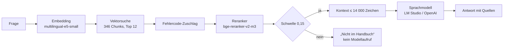

# RAG-Lab

**Live:** [swrobuts.github.io/RAG-Lab](https://swrobuts.github.io/RAG-Lab/)

Interaktive Lernumgebung zu **Retrieval-Augmented Generation** und Sprachmodellen für die
THWS Business School. Zehn Labs führen von Token und Vektor über Chunking, Embeddings,
Retrieval, Reranking und Generierung bis zu Evaluation, Architektur und dem Nachbau eines
lokalen Handbuchassistenten. **55 Übungen** in neun Formen, jede mit sofortiger Rückmeldung;
**16 lebende Werkzeuge**, vom Tokenizer bis zum nachgebildeten Terminal.

Das Fallbeispiel ist der Waschmaschinen-Assistent
[SiemensWashingMachineTroubleShooting_LocalLLM](https://github.com/swrobuts/SiemensWashingMachineTroubleShooting_LocalLLM):
ein Flask-Server mit LlamaIndex, `multilingual-e5-small`, `bge-reranker-v2-m3` und LM Studio
oder OpenAI als Antwortmodell. Die Labs erklären ihn Schritt für Schritt, mit seinem Code, seinen
Messprotokollen und seinen Fehlern. **Jede Zahl im Text stammt aus einer Datendatei**, die aus
dem Fallbeispiel erzeugt wurde; ein Prüflauf vergleicht Text und Daten.

Die Umgebung ist zweisprachig (Deutsch / Englisch) und läuft als statische Seite auf GitHub
Pages: ohne Build-Schritt, ohne Server, ohne Anmeldung. Schwesterprojekte: PROM-Lab
(Prozessmodellierung), DABA-Lab (Datenbanken), PITM-Lab (IT-Management).



---

## Wie das Modell in den Browser kommt

Das Embedding-Modell des Fallbeispiels läuft in der Seite selbst: **transformers.js 4.3.0**
(`@huggingface/transformers`) mit **onnxruntime-web 1.31.0-dev** führt
`Xenova/multilingual-e5-small` als ONNX-Modell in 8-Bit-Quantisierung aus (`dtype: 'q8'`,
`device: 'wasm'`). Bibliothek und WASM-Laufzeit liegen unter `assets/transformers/` (27 MB) bei,
damit die Seite nicht von einem CDN abhängt; die Gewichte (118 MB) und der Tokenizer (17 MB)
werden **erst auf Klick** vom Hugging-Face-Hub geladen und danach im Browser-Cache gehalten.

Der Weg ist bewusst nur WASM: q8 ist der kleinste Download, WebGPU bräuchte fp16 (235 MB), und
ohne Cross-Origin-Isolation läuft WASM auf GitHub Pages einfädig – langsamer als WebGPU,
für einen Vektor je Frage aber kurz genug (Messwert in `PRUEFBERICHT.md`). Ein **Selbsttest** vergleicht den
Browser-Vektor einer Katalogfrage mit dem Python-Vektor aus `data/fragen.json` (Kosinus > 0,99;
gemessen 0,996). Ist der Hub nicht erreichbar, arbeiten alle Werkzeuge mit den vorberechneten
Vektoren der 24 Katalogfragen weiter; nur eigene Fragen brauchen das Modell.

Der Reranker (279 MB) läuft nicht im Browser. Seine Scores für die Katalogfragen wurden mit der
Python-Umgebung des Fallbeispiels berechnet und stimmen mit dessen Protokoll auf vier
Nachkommastellen überein.

**Eigenes Sprachmodell:** Lab 07 schickt den echten RAG-Prompt an einen OpenAI-kompatiblen
Endpunkt (LM Studio mit `lms server start --cors`, Ollama mit `OLLAMA_ORIGINS`) und zeigt die
Antwort im Stream. Ohne Server zeigt es aufgezeichnete Antworten von gemma-4-12b. Safari
blockiert Aufrufe an `http://localhost` von einer HTTPS-Seite; Chrome, Edge und Firefox
erlauben sie.

---

## Aufbau

```
RAG-Lab/
├── index.html                    Startseite: Labs, Stand, erste Suche
├── lab-01-sprachmodelle.html     … lab-10-nachbauen.html
├── assets/
│   ├── rag.css                   Gestaltung (Sandbeige, Terrakotta, Umbra)
│   ├── rag.js                    Laufzeit: Sprache, LABS, Übungsboxen, Fortschritt
│   ├── pruefung.js               Prüflogik ohne DOM (Kosinus, Metriken, Prüfer je Übungstyp)
│   ├── chunking.js               Port der Chunking-Regeln des Fallbeispiels
│   ├── modell.js                 transformers.js-Anbindung, Selbsttest
│   ├── terminal.js               Nachgebildete Shell (zsh, PowerShell) mit Weltzustand
│   ├── werkzeuge/                16 lebende Stücke, je ein Modul
│   ├── transformers/             transformers.min.js, ONNX-Runtime (WASM), Lizenzen
│   ├── diagramme/                Mermaid-Diagramme als SVG, je Sprache
│   └── seite-33.png              Handbuchseite 33 (Docling-Vergleich)
├── data/
│   ├── chunks.json               346 Chunks mit 384-dim-Vektoren
│   ├── fragen.json               24 Katalogfragen: Vektoren, Kandidaten, Reranker-Scores
│   ├── eval/                     Messprotokolle des Fallbeispiels (kopiert)
│   ├── tokens.json, logits.json  Tokenizer-Zählungen, Logits von Qwen2.5-0.5B
│   ├── antworten.json            Aufgezeichnete Antworten von gemma-4-12b (LM Studio)
│   ├── betrieb.json              Fingerprint, Speichergrößen, Live-Tokens, Commits
│   ├── handbuch.md, seite-33.md  Handbuchtexte aus dem Fallbeispiel
│   └── uebungen/lab-NN.json      Übungen je Lab
├── diagramme/quellen/*.mmd       Mermaid-Quellen mit [[de|en]]-Platzhaltern
├── tools/
│   ├── daten.sh, *.py            Datenpipeline aus dem Fallbeispiel (nur lesend)
│   ├── gen_diagramme.mjs         Mermaid → SVG in beiden Sprachen
│   ├── verify.mjs                Abnahmelauf: Labs, Übungen, Werkzeuge, jede Zahl im Text
│   ├── pruefung.test.mjs         Tests der Prüflogik und des Terminals
│   └── pruefung/                 Browser-Skripte für Durchlauf und Audit
├── QUELLEN.md                    Alle Quellen je Lab
└── PRUEFBERICHT.md               Stand der Abnahme
```

Jedes Lab ist eine Seite mit Seitennavigation, Lernzielen, Abschnitten, Diagrammen,
Begriffskarten, Werkzeugen, Übungen, Zusammenfassung und Quellen. Die Übungen stehen als JSON
in `data/uebungen/`; im HTML steht nur `<div data-uebung="R08-03"></div>`. Werkzeuge werden mit
`<div data-werkzeug="schwelle" data-parameter='{"schwelle":0.15}'></div>` eingebunden.
Texte liegen als Paare `<span lang="de">…</span><span lang="en">…</span>` nebeneinander;
der Umschalter oben rechts blendet eine Sprache aus.

---

## Neun Übungstypen

| Typ | Was Studierende tun | Prüfung |
|---|---|---|
| `quiz` | Eine oder mehrere Optionen wählen | Indexvergleich, Erklärung je Frage |
| `experiment` | Ein Werkzeug bedienen, dann Prüffragen beantworten | wie quiz; Werkzeug im Kasten |
| `zuordnen` | Elemente Kategorien zuordnen | Zielvergleich |
| `sortieren` | Schritte mit ▲▼ in Reihenfolge bringen | Positionsvergleich, deterministisch gemischt |
| `rechnen` | Zahlen berechnen und eintragen | Toleranz je Feld, Lösungsweg nach Prüfung |
| `luecken` | Lücken in Code oder Text füllen | Lösungsliste oder Muster; gleiche Nummern spiegeln |
| `belegen` | Behauptungen einer Antwort gegen Chunks prüfen | belegt / nicht belegt je Behauptung |
| `checkliste` | Schritte abarbeiten, je Schritt eine Prüffrage | Index je Schritt |
| `terminal` | Befehle in der nachgebildeten Shell eingeben | Schrittfolge mit Muster und Weltzustand |

Alle Prüfer liegen in `assets/pruefung.js` und laufen ohne Browser in `tools/pruefung.test.mjs`.

---

## Sechzehn Werkzeuge

| Werkzeug | Lab | Was es zeigt |
|---|---|---|
| `tokenizer` | 01, 04 | Text in Tokens des e5-Tokenizers zerlegen (live nach Laden des Tokenizers) |
| `temperatur` | 01 | Logits von Qwen2.5-0.5B, Softmax bei wählbarer Temperatur |
| `kontext` | 01, 02 | Kontextfenster und Zeichenbudget füllen |
| `vergleich` | 02 | Antwort ohne und mit Kontext (aufgezeichnet) nebeneinander |
| `seite` | 03 | Handbuchseite 33 als Bild neben dem Docling-Markdown, Fundstellen markiert |
| `chunking` | 04 | Drei Chunking-Strategien am echten Handbuchtext, Tokens gezählt |
| `embedding` | 05 | Zwei Texte einbetten, Kosinus, Präfix-Effekt |
| `karte` | 05 | 346 Chunks in zwei Dimensionen projiziert, eigene Frage einzeichnen |
| `suche` | 06, Startseite | Stepper: Vektorsuche, Fehlercode, Reranker, Schwelle, Entscheidung |
| `prompt` | 07 | Systemprompt und JSON-Nutzernachricht mit Kontextbudget |
| `llm` | 07 | Eigenes Modell per SSE anrufen; Fallback auf Aufzeichnungen |
| `metrik` | 08 | Hit@5, Hit@1, MRR, Abdeckung selbst rechnen, drei Varianten |
| `schwelle` | 06, 08 | Regler über 14 echte Reranker-Scores auf logarithmischer Achse |
| `architektur` | 09 | Klickbares Komponentendiagramm mit Aufgabe und „Darf nie“ |
| `kosten` | 09 | Cloud je Token gegen lokale Anschaffung und Strom |
| `terminal` | 10 | zsh oder PowerShell mit git, venv, pip, curl, lms, den Skripten des Fallbeispiels |

---

## Daten neu erzeugen

Die Datendateien entstehen aus dem Fallbeispiel und dessen Python-Umgebung (Python 3.12,
sentence-transformers, llama-index). Pfad in `tools/fall.py` oder über `RAG_FALL`:

```bash
sh tools/daten.sh            # Chunks, Fragen, Projektion, Tokens, Logits, Seite 33, Betrieb
sh tools/daten.sh --mit-llm  # zusätzlich die Antworten aufzeichnen (LM Studio muss laufen)
node tools/gen_diagramme.mjs # Mermaid-Quellen → SVG (braucht npx)
```

`tools/betrieb.py` rechnet den SHA-256-Fingerprint des Fallbeispiels nach und bricht ab, wenn
er nicht zum gespeicherten passt. Die Skripte lesen nur; das Fallbeispiel bleibt unverändert.

---

## Nach jeder Änderung prüfen

```bash
npm test          # Prüflogik und Terminal (node --test)
npm run verify    # Labs, Übungen, Werkzeuge, Daten, jede markierte Zahl im Text
```

`verify.mjs` prüft auch die `data-wert`-Marker: Jede Zahl aus dem Fallbeispiel steht im HTML
als `<span data-wert="eval.rerank.hit5">100</span>`, und der Lauf vergleicht sie mit der
Datendatei – in deutscher und englischer Schreibweise. Wörtliche Blöcke tragen
`data-wert-text`. Terminal-Übungen führen ihre Musterlösung in beiden Shells aus.

Im Browser (Konsole einer Lab-Seite): `tools/pruefung/durchlauf.js` löst jede Übung mit der
Musterlösung und erwartet „Richtig“; `tools/pruefung/audit.js` prüft Überschriften,
Alternativtexte, Beschriftungen, Links, Überlauf und deutsche Reste im EN-Modus.

---

## Fortschritt

Gelöste Übungen liegen im `localStorage` unter `rag:fortschritt:<lab>`, die Sprache unter
`rag:sprache`, der Modell-Endpunkt unter `rag:llm`, die Terminalzustände unter
`rag:terminal:<id>`. Nichts davon verlässt das Gerät. Die Startseite zeigt den Gesamtstand
und je Lab einen Balken; „Lernfortschritt löschen“ lässt Endpunkt und Terminals stehen.

---

## Veröffentlichen

```bash
gh repo create swrobuts/RAG-Lab --public --source=. --push
gh api repos/swrobuts/RAG-Lab/pages -X POST -f source[branch]=main -f source[path]=/
```

`.nojekyll` liegt bei. Nach der Veröffentlichung prüfen, ob die ausgelieferten Dateien dem
lokalen Stand entsprechen (SHA-256 von `assets/rag.js`, `data/chunks.json`, einer Übungsdatei).

> Ein öffentliches Repository macht auch die Musterlösungen lesbar. Für eine Selbstlernumgebung
> ist das unproblematisch; als Prüfungsinstrument ist der Aufbau nicht geeignet.

---

## Herkunft der Inhalte

Die Fachinhalte folgen den in `QUELLEN.md` genannten Arbeiten (Vaswani et al. 2017, Lewis et
al. 2020, Wang et al. 2024, Chen et al. 2024, Es et al. 2023 und weitere) und der Dokumentation
der eingesetzten Werkzeuge. Das Fallbeispiel, seine Messprotokolle und die Handbuchtexte
stammen aus dem Repository `SiemensWashingMachineTroubleShooting_LocalLLM` (Stand 19.09.2026);
zur Herkunft der Handbuchtexte siehe `data/QUELLE.md`. Alle Texte der Labs wurden mit dem
Prüfverfahren aus `PRUEFBERICHT.md` durchgesehen.

Lizenzen der mitgelieferten Bibliotheken: transformers.js (Apache-2.0), ONNX Runtime (MIT);
siehe `assets/transformers/`. Das Modell `intfloat/multilingual-e5-small` steht laut
Modellkarte unter MIT; die ONNX-Fassung `Xenova/multilingual-e5-small` wird zur Laufzeit vom
Hugging-Face-Hub geladen und ist nicht Teil dieses Repositories.

---

THWS Business School · Prof. Dr. Robert Butscher
